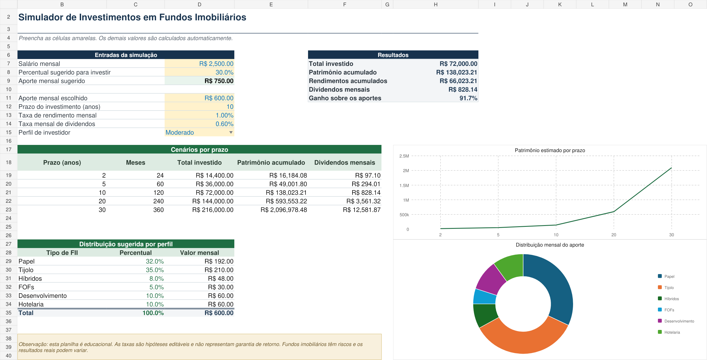
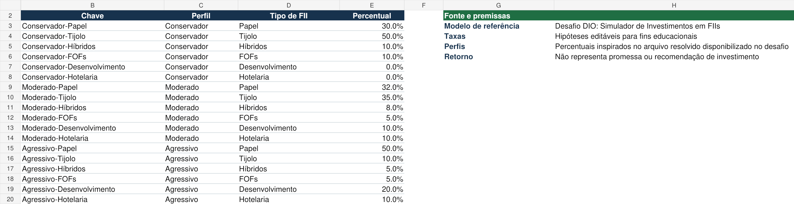

# Simulador de Investimentos em Fundos Imobiliários

Projeto desenvolvido como parte de um desafio prático da DIO. O objetivo é aplicar conceitos de Excel na criação de uma ferramenta para simular aportes mensais em fundos imobiliários e visualizar possíveis resultados ao longo do tempo.



## Funcionalidades

- Cálculo do aporte sugerido com base no salário e no percentual informado;
- Simulação do patrimônio acumulado com aportes mensais e juros compostos;
- Cálculo do total investido, dos rendimentos acumulados e dos dividendos mensais estimados;
- Comparação de resultados para prazos de 2, 5, 10, 20 e 30 anos;
- Seleção de perfil conservador, moderado ou agressivo;
- Distribuição do aporte entre diferentes tipos de fundos imobiliários;
- Gráficos de evolução patrimonial e distribuição do aporte.

## Como utilizar

1. Abra o arquivo `Simulador_Investimentos_FII_Izabela.xlsx` no Excel.
2. Acesse a aba **Simulador**.
3. Preencha as células amarelas com salário, percentual de investimento, aporte mensal, prazo, taxas e perfil.
4. Consulte os resultados calculados automaticamente.
5. Compare os cenários e a distribuição sugerida para o perfil selecionado.

## Cálculos aplicados

O total investido é calculado pela multiplicação do aporte mensal pela quantidade de meses:

```text
Total investido = aporte mensal × prazo em anos × 12
```

O patrimônio acumulado considera aportes realizados ao final de cada mês e uma taxa mensal constante:

```text
Patrimônio = aporte × ((1 + taxa mensal) ^ número de meses - 1) ÷ taxa mensal
```

Os rendimentos acumulados correspondem à diferença entre o patrimônio final e o total aportado:

```text
Rendimentos = patrimônio acumulado - total investido
```

Os dividendos mensais são estimados a partir do patrimônio acumulado:

```text
Dividendos mensais = patrimônio acumulado × taxa mensal de dividendos
```

## Estrutura do arquivo

- **Simulador:** concentra as entradas, os resultados, os cenários e os gráficos.
- **Perfis:** contém a tabela de percentuais utilizada na distribuição por tipo de FII.



## Conceitos praticados

- Fórmulas e referências absolutas;
- Juros compostos;
- Validação de dados com lista suspensa;
- Busca de valores em tabela com `ÍNDICE` e `CORRESP`;
- Formatação de números e percentuais;
- Organização visual e criação de gráficos;
- Documentação técnica com Markdown e GitHub.

## Arquivo de referência

O desafio disponibilizou uma [planilha resolvida como material de apoio](https://hermes.dio.me/files/assets/a04b81b1-8e35-4e72-aeb9-98aed8ed4403.xlsx). Este repositório apresenta uma implementação própria baseada nos requisitos propostos.

## Observação

Este projeto tem finalidade educacional. As taxas utilizadas são hipóteses editáveis e não representam garantia de retorno ou recomendação de investimento.

## Autora

Izabela
